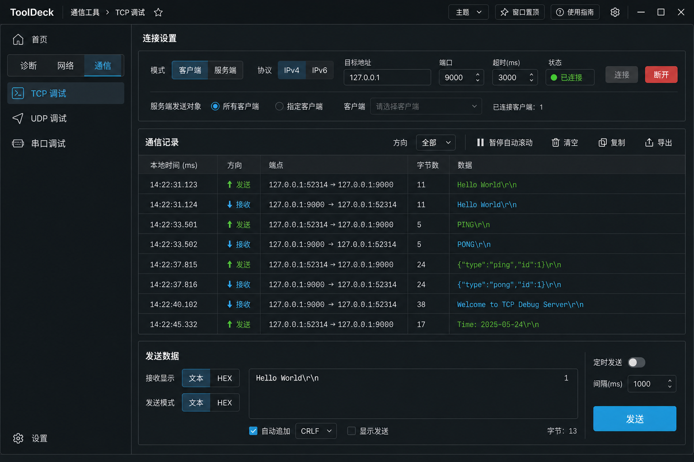

# Windows Toolbox

ToolDeck 是一个面向 Windows 10/11 x64 的原生系统与网络工具工作台。V0.4.1 采用统一的深色专业工作台界面，提供诊断、网络和通信三类十个工具，并继续使用可扩展的 Tool Host + Tool Module 架构。



## 当前功能

- 文件占用：使用 Restart Manager 查找正在占用文件的进程，支持系统文件选择器、回车与重查、拖放、完整报告和资源管理器右键调用。
- 端口占用：使用 IP Helper 的扩展 TCP/UDP 表读取 IPv4、IPv6 端点，支持组合筛选、排序、暂停、复制、CSV，以及 1/2/5/10 秒自动刷新。
- 进程关系：默认后台加载全部进程树，支持折叠、展开、搜索、刷新、进程选择、WMI 懒加载命令行、完整父进程链和直接子进程。
- 资源管理器集成：在设置中按用户选择注册或移除 `HKCU\Software\Classes\*\shell\WindowsToolbox` 下的经典 Shell Verb，不需要管理员权限。Windows 11 上该菜单可能位于“显示更多选项”。
- 单实例：后续启动会通过命名管道将 `ToolInvocation` 转发给已运行实例，并激活对应工具页面。
- 后台执行：固定四个 Worker 线程与容量 32 的有界请求队列提供背压；同一工具只接收最新请求结果。
- DNS、Ping、TCP 快测与 MTR：支持周期 DNS、持续 Ping、重复 TCP 握手、逐跳抖动与实时趋势，并提供停止、过滤、复制和导出能力。
- TCP 调试：支持 IPv4/IPv6 客户端自动重连与最多 32 个客户端的服务端，按选中客户端或全部客户端持续收发原始字节流。
- UDP 调试：支持 IPv4/IPv6 单播、IPv4 广播、单个 IPv4 组播组，以及回复选中接收来源。
- 串口调试：枚举 COM 与 USB 描述，支持波特率、数据位、校验位、停止位、流控、读取超时和 RTS/DTR 手动控制。
- 通信记录：TCP、UDP 与串口支持独立文本/HEX 显示、CRLF、定时发送、有界记录、方向与文本过滤、复制和 UTF-8 `.log` 导出。
- 界面与设置：固定深色石墨工作台、单列三类导航、窄屏同列收展和非敏感参数预设；旧主题字段仅兼容读取。
- 本地诊断：设置采用原子替换和唯一损坏备份，脱敏诊断日志按 512 KiB、最多三份轮转。

## 架构

```text
Tool Host (src/app/mod.rs)
  ├── Tool Registry (src/tools/registry.rs)
  │     ├── File Lock Tool
  │     ├── Port Inspector Tool
  │     ├── Process Inspector Tool
  │     ├── DNS Lookup Tool
  │     ├── Ping Tool
  │     ├── TCP Probe Tool
  │     ├── MTR Tool
  │     ├── TCP Debug Tool
  │     ├── UDP Debug Tool
  │     └── Serial Debug Tool
  ├── App Shell (src/app/)
  │     ├── state / navigation / content / layout
  │     └── actions / overlay
  ├── Core: Invocation / Action / Worker / Communication Dispatcher
  ├── Domain Model: File / Network / Process / Communication / Error
  └── Windows Platform Layer: Restart Manager / IP Helper / Toolhelp / Serial / Shell / IPC
```

新增一个内建工具的方式是：在 `src/tools/` 创建模块，实现 `ToolModule`，然后在 `src/tools/mod.rs` 的 `build_registry()` 中注册。导航、搜索和首页会自动发现其描述信息。

## 启动调用

```text
Toolbox.exe --tool file-lock --path "D:\Test\data.db"
Toolbox.exe --tool port-inspector --port 8080
Toolbox.exe --tool process-inspector --pid 18324
Toolbox.exe --tool dns-lookup --host example.com
Toolbox.exe --tool ping --host example.com
Toolbox.exe --tool tcp-probe --host example.com --port 443
Toolbox.exe --tool mtr --host example.com
```

所有命令行、资源管理器右键菜单和跨工具跳转都会转换为同一个 `ToolInvocation` 结构。

TCP、UDP 与串口通信调试不增加命令行入口，连接参数、发送载荷和通信记录也不会自动持久化。

## 构建

目标平台为 `x86_64-pc-windows-msvc`，发布配置启用 LTO、单 codegen unit、静态 CRT、`panic = "abort"` 和 strip。Windows 清单以 `asInvoker` 运行，并声明 Per Monitor V2 DPI awareness。

```bash
cargo fmt --all -- --check
cargo clippy --all-targets --all-features -- -D warnings
cargo test --all-targets --all-features
cargo build --release
cargo build --release --target x86_64-pc-windows-msvc
```

发布文件预期位置：

```text
target\x86_64-pc-windows-msvc\release\windows-toolbox.exe
```

## 权限与限制

- 默认以普通用户权限运行；部分系统进程的信息或结束操作会因访问限制而失败，并向用户明确提示。
- V0.4.1 通过公开 Toolhelp、WMI/COM、Windows ICMP API、标准套接字和 serialport 访问系统能力；不使用未公开 NT API，也不实现深度句柄扫描、强制关闭 Handle、驱动、注入或权限绕过。
- TCP 调试只收发原始字节流，不提供 TLS；UDP 当前不支持 IPv6 广播或 IPv6 组播；串口采用独占打开。

网络工具：

- `--tool dns-lookup --host example.com`
- `--tool ping --host example.com`
- `--tool tcp-probe --host example.com --port 443`
- `--tool mtr --host example.com`
- Restart Manager 的结果受 Windows 支持范围限制，未返回进程不代表可安全强制解锁。
- 右键菜单采用稳定的传统 Shell Verb；没有实现 Windows 11 一级现代菜单所需的 `IExplorerCommand` COM 扩展。
